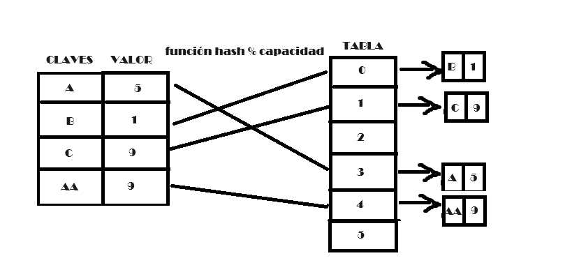

# TDA HASH

## Repositorio de Facundo Lescano - 110784 - flescano@fi.uba.ar

- Para compilar:

```bash
make pruebas_chanutron

make pruebas_alumno

make ejemplo

```

- Para ejecutar:

```bash

./pruebas_chanutron

./ejemplo

./pruebas_alumno

```

- Para ejecutar con valgrind:
```bash
make valgrind-chanutron

valgrind ./ejemplo

valgrind ./pruebas_alumno
```
---
##  Funcionamiento

Este TDA es una implementacion de un hash abierto con direccionamiento cerrrado la cual utiliza dos estructuras para su implementacion. La primer estructura es de pares, que contiene clave, valor y siguiente par; y la estructura hash que contiene la capacidad de la tabla, la cantidad de pares y la tabla.
Esta es una abstraccion de como se encontrara un hash creado en memoria.

<div align="center">

</div>

Se definieron las operaciones crear, insertar, quitar, obtener, contiene, cantidad, destruir, destruir_todo y con cada clave; orientadas segun el contrato establecido en hash.h.
Para esta implementacion se requiere reservar memoria en el heap para la estructura hash, para los punteros a a cada posicion de la tabla, para cada par que se va a insertar y para las claves de los pares a a insertar.

-Complejidades computacionales:

La funcion crear va a ser O(1) ya que realiza operaciones constantes. Al igual que hash_cantidad.

Las complejidades de las funciones destruir, destruir todo, con cada elemento van a ser O(N) ya que deberan recorrer cada elemento. Excepto que la funcion invocada en el iterador interno tenga una condicion de corte que recorte la iteracion.

Insertar, quitar, obtener y contiene: al utilizar la funcion hash para conocer la posible posicion a insertar a obtener o a quitar, unicamente recorreran, en el peor de los casos, hasta el final de las colisiones en esa posicion. Lo cual, si hay pocas colisiones tendra que recorrer pocos pares(mucho menos que la cantidad de pares) y su complidad sera ~~ O(1). En el peor de los casos, que todos los elementos del hash esten colisionados en esa posicion calculada, la complejidad sera O(n).

En el caso de insertar, si la capacidad ocupada del hash supera el 75%, se realizara un rehash el cual agrandara la capacidad del diccionario y reinsertara cada elemento en la tabla. Esto implica un costo dependiente de la cantidad de elementos, es decir, en estos casos la complejidad sera de O(n) causada por el rehash + la complidad de insertar un elemento... la complejidad sera O(n) o O(2n) ~~ O(n).


## Respuestas a las preguntas teóricas

   Un diccionario es una coleccion de claves las cuales almacenan un valor. Brinda una performance a la hora de acceder a datos. 
   La funcion hash es una operacion que transforma una clave a un numero asociado, para luego determinar su posicion en el diccionario. En lo posible esta funcion debe redistribuir de manera semi uniforme las claves, es decir, que no todas las claves tengan el valor asociado a un numero comun, debido a que si esto pasa todas las claves tendrian el mismo valor asociado y ocuparian una unica posicion en el hash.
   Cada diccionario tienen una tabla de hash. Esta es una estructura que contiene valores que se pueden hallar a partir de claves. Cada clave tiene una posicion en la tabla del hash determinada por su numero asociado calculado por la funcion hash y por la capacidad de la tabla del hash.

   <div align="center">
   
   </div>

   Estas claves pueden compartir valor de hash independientemente de que sean iguales. En este caso, se producira una "colision". Que dependiendo de la implementacion del hash (segun el tipo de hash) sus colisiones se encadenaran o se buscara un lugar libre en la tabla para ubicar esta clave.
   En este tda, el tipo de hash es abierto donde cada elemento se guarda fuera de la tabla de hash y su direccionamiento es cerrado ya que en la unica posicion que se puede encontrar una clave es en la posicion determinada por su valor asociado. En un hash cerrado, todos los valores se guardan dentro de una misma tabla, y si hay claves con el mismo valor asociado la posicion de la segunda clave sera la de el proximo espacio libre en la tabla(se cambiara su posicion).
   En el caso que se quiera un par clave valor que tenga la misma clave que un par ya insertado, su valor se actualizara. Es decir, no se insertara el nuevo par, solo se cambiara el valor de el par que ya estaba en la tabla (por convencion de este TDA).

   <div align="center">
   
   </div>

   La tabla de hash siempre tendra una capacidad determinada, la cual sera dinamica. Esta capacidad ira aumentando segun la cantidad de pares clave-valor almacenadas y su factor de balanceo para agrandar la capacidad sera cuando haya un 75% de la capacidad ocupada. A la operacion de agrandar la capacidad del hash se la denomina rehash y se encarga tambien de reinsertar cada clave-valor segun el valor asociado de cada clave y la capacidad nueva del hash.
